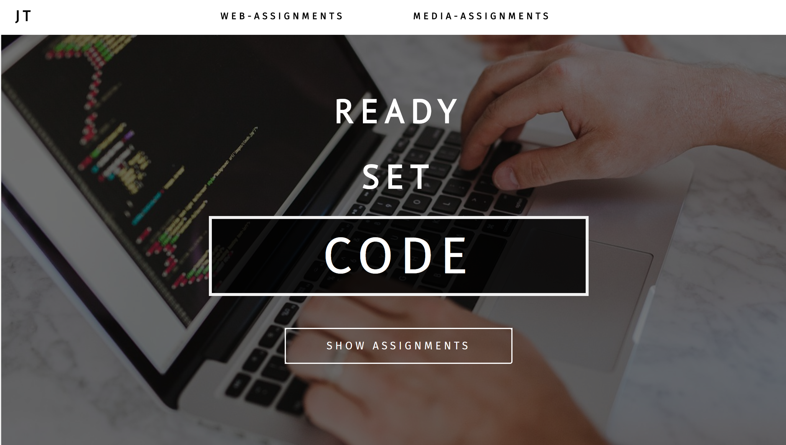

<h1>Digimedia Portfolio </h1>

Watch site on live:
<a href="https://jennaturunen.github.io/Digimedia-Portfolio/portfolio.html">Portfolio</a>

Ensimmäinen isompi projekti, joka on alusta loppuun asti tehty itse. Tehty koulutehtävänä, jonka tarkoituksena oli luoda oma portfolio kaikille sen kurssin aikana tehdyille tehtäville. Tehtäviin johtavat linkit eivät enää ole toiminnassa. 

Käytetyt tekniikat:

- HTML
- CSS/SCSS (npm)
- jQuery
- Bootstrap
- JavaScript

First larger project, that I made myself from start to finish. Made as a school assignment where the idea was to gather all exercises to one page. The links are no longer working.

Used techniques: 

- HTML
- CSS/SCSS (npm)
- jQuery
- Bootstrap
- JavaScript
